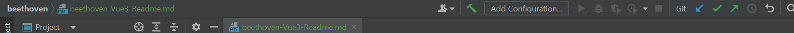

# beethoven 前端笔记

#### 如何从github上clone项目后在本机启动？
在项目下打开终端，然后
~~~
cd .\beethoven-frontend-vue3\
npm install
npm run dev
~~~

#### 如何设置服务器启动configuration?
选择Add Configuration

然后在"Add New Configuration"中选择npm

在选项中设置“package.json"与"scripts"

完成后，就可以通过选择对应configuration启动服务器

#### 如何修改服务器端口？
打开package.json文件,在“scripts”配置项下的"dev":"vite" 选项中增加--port XXXX（你想要设置的端口，默认为3000）

